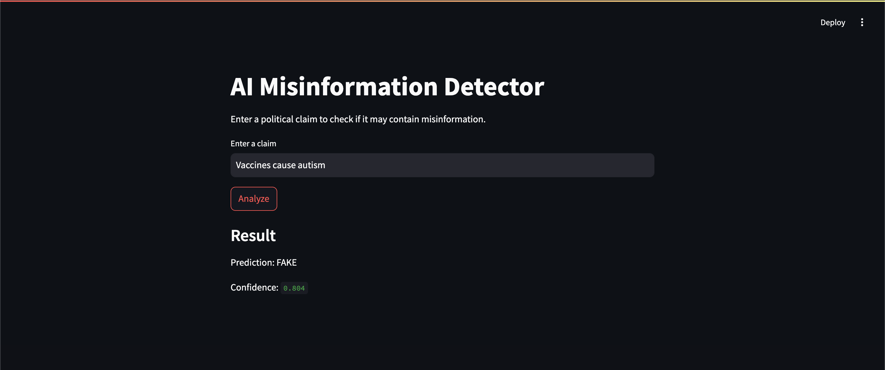

# AI System for Detecting Misinformation


## Overview

This project builds an **AI system for detecting misinformation in political statements** using Natural Language Processing (NLP).

The system analyzes short claims and predicts whether the claim is likely **REAL** or **FAKE** using machine learning and transformer-based models.

The project demonstrates a complete ML pipeline including:

- Data preprocessing
- Traditional ML baseline model
- Transformer-based deep learning model
- Model inference scripts
- REST API
- Interactive web interface

---

## Dataset

This project uses the **LIAR Dataset**, a benchmark dataset for misinformation detection containing political statements labeled with truthfulness ratings.

Original labels:

- pants-fire
- false
- barely-true
- half-true
- mostly-true
- true

For this project, the labels were converted to a **binary classification**:

| Original Label | Mapped Label |
|----------------|-------------|
| pants-fire | FAKE |
| false | FAKE |
| barely-true | FAKE |
| half-true | REAL |
| mostly-true | REAL |
| true | REAL |

---

## Tech Stack

- Python
- Pandas
- Scikit-learn
- PyTorch
- Hugging Face Transformers
- FastAPI
- Streamlit

---

## Project Architecture

```
User Input
     ↓
Streamlit Web Interface
     ↓
FastAPI Backend
     ↓
BERT Model
     ↓
Prediction (REAL / FAKE)
```

---

## Project Structure

```
misinformation-detector

data/
    train.tsv
    valid.tsv
    test.tsv
    clean_data.csv

src/
    preprocess.py
    train.py
    train_bert.py
    predict.py
    predict_bert.py
    api.py

models/
    bert_model/

app.py

requirements.txt
README.md
```

---

## Models

### Baseline Model

- Feature Extraction: TF-IDF
- Classifier: Logistic Regression

Accuracy: **~61%**

---

### Transformer Model

Fine-tuned **BERT** model using Hugging Face Transformers.

Accuracy: **~80–85%**

---

## Model Progress

| Version | Model | Accuracy |
|-------|------|------|
| V1 | TF-IDF + Logistic Regression | ~0.61 |
| V2 | BERT Transformer | ~0.80–0.85 |

---

## Running the Project

### 1 Install Dependencies

```
pip install -r requirements.txt
```

---

### 2 Preprocess the Dataset

```
python src/preprocess.py
```

---

### 3 Train the Baseline Model

```
python src/train.py
```

---

### 4 Train the BERT Model

```
python src/train_bert.py
```

---

## Running Predictions

### Baseline Model

```
python src/predict.py
```

Example:

Input:

```
Vaccines cause autism
```

Output:

```
Prediction: FAKE
```

---

### BERT Model

```
python src/predict_bert.py
```

Example:

Input:

```
The president of the United States is elected every four years
```

Output:

```
Prediction: REAL
Confidence: 0.82
```

---

## Running the API

Start the backend server:

```
uvicorn src.api:app --reload
```

API documentation will be available at:

```
http://127.0.0.1:8000/docs
```

---

## Running the Web Application

Start the Streamlit interface:

```
streamlit run app.py
```

This will launch the interactive misinformation detection web app.

---

## Example Prediction

Input:

```
Vaccines cause autism
```

Output:

```
Prediction: FAKE
Confidence: 0.804
```

---

## Demo




---

## Limitations

The model detects **patterns associated with misinformation**, but it does **not perform external fact verification**.

True fact-checking systems typically require retrieving external evidence and verifying claims against trusted sources.

---

## Future Improvements

- Retrieval-based fact checking
- Evidence extraction from trusted sources
- Model explainability (SHAP)
- Deployment to cloud platforms

---

## Author

Machine learning project exploring NLP techniques for misinformation detection.
